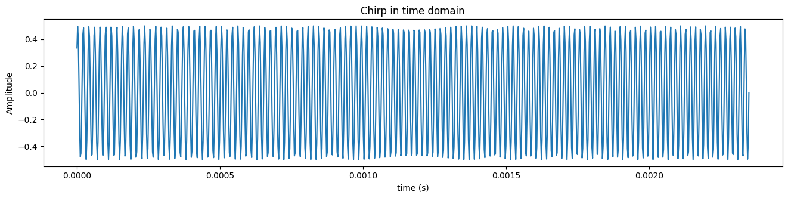
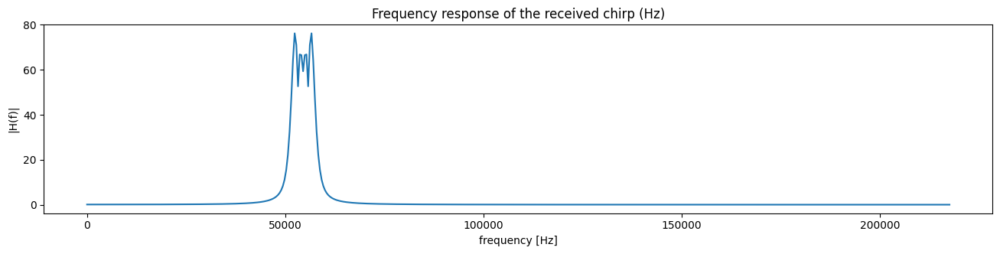
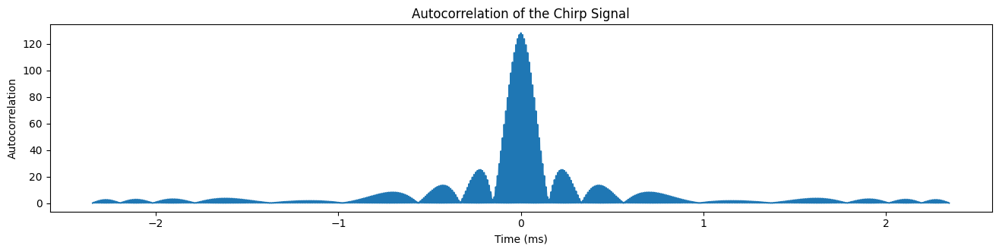
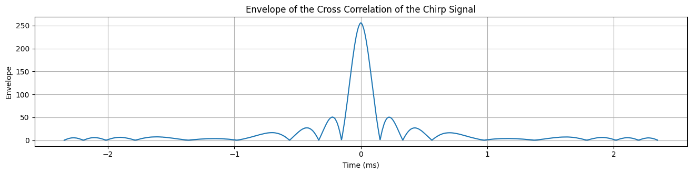
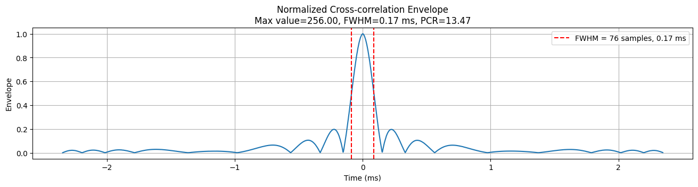

# Pulse Compression(JP)



#### 送信信号の強度を上げてはいけないのか？

短いCWパルスを維持したまま、センサーマイクが送る信号の強度を上げればいいのではないだろうか？実際、信号の強度を無闇に上げることはできない。コンピュータのスピーカーを考えてみよう。コンピュータのスピーカーのボリュームを上げて、継続的に大きな音を出すと、消費電力も大きくなり、スピーカーの耐久性にも問題が生じる可能性がある。そもそも大きな音を出すためには、コンピュータのスピーカーのハードウェアスペックも良くなければならない。

センサーも同様だ。信号強度を上げるためには、大きな消費電力に耐えられる高電圧の電源とマイクが必要だ。大きな音を出すためには、マイクは高価になり、大きくなり、追加の耐久性テストも必要となる。そのため、無闇に信号の強度を上げてSNRを確保するという方法は現実的ではない。

### 線形周波数変調によるパルス圧縮

***

#### 基本原理

それでは、SNRを確保しながらもパルスを十分に長くし、距離分解能を犠牲にしない方法はないだろうか？ここでパルス圧縮が登場する。パルス圧縮の基本原理は次の2つである。

* 信号のエネルギーが十分に保存されるように、信号を長時間送信する
* マッチドフィルタ（matched filtering）後に、相関信号の長さが一般的なCWサイン波の信号の長さよりも短くなるように信号を設計する

自動車のADASセンサー、特にレーダーや超音波ではパルス圧縮のために主に線形チャープ（linear chirp、周波数が時間に応じて一定に変調される信号）が使用される。まず送信信号の長さをTとしよう。t=0から始まり、t=Tで終わるこの信号の周波数がキャリア周波数 $$f_c$$を中心に $$\Delta f$$だけ線形的に変化する場合、信号$$s_c(t)$$の式は次のように表せる。

$$
s_c(t) = \left\{ \begin{array}{ll} e^{i 2 \pi \left( \left( f_c \,-\, \frac{\Delta f}{2}\right) t \, + \, \frac{\Delta f}{2T}t^2 \, \right)} &\mbox{if} \; 0 \leq t < T \\ 0 &\mbox{otherwise}\end{array}\right.
$$

<details>

<summary>式の導出</summary>

信号の周波数はキャリアー周波数 $$f_c$$を中心に $$\Delta f$$だけ変化する。つまり、周波数は $$f_c - \Delta f/ 2$$ (t=0)から $$f_c + \Delta f/ 2$$(t=T)まで変わる。したがって、これを時間の関数として表せば、t時点の瞬間周波数を定義できる。

$$f(t) = f_c - \Delta f/2  + (\Delta f/T)t$$

瞬間周波数を時間に対して積分すれば、次のように位相も求めることができる。

$$\phi(t) = 2\pi\int_0^t f(t')dt' = 2\pi\int_0^t (f_c - \Delta f/2  + (\Delta f/T)t')dt' = 2\pi(f_c - \Delta f/2  + (\Delta f/{2T})t)t$$

したがって、複素数信号表 $$s_c(t) = e^{i\phi(t)}$$に、上記で求めた位相の式を代入すれば、信号の式を得ることができる。

参考として、複素数表現には信号の位相と振幅を分離して解析できるという利点がある。また、この表現はオイラーの公式$$e^{i\phi(t)} = cos(\phi(t)) + isin(\phi(t))$$に基づいている。

</details>

上記の式が線形周波数変調された信号で、通常英語ではチャープ（chirp）と呼ばれる。このチャープ信号の位相は次のように表せる。

$$
\phi(t) = 2\pi \left( \left( f_c \,-\, \frac{\Delta f}{2}\right) t \, + \, \frac{\Delta f}{2T}t^2 \, \right)
$$

したがって、瞬間周波数（instantaneous frequency）は定義に従って次のように計算される。「ちょっと待って、なぜ瞬間周波数は位相を時間で微分するのだろう？」という疑問が浮かんだら、別の記事 [instantaneous-phase-and-frequency.md](instantaneous-phase-and-frequency.md "mention")を読んでみよう。

$$
f(t) = \frac{1}{2\pi}\left[\frac{d\phi}{dt}\right ]_t = f_c-\frac{\Delta f}{2}+\frac{\Delta f}{T}t
$$

周波数がどのように変化するかを見るためには、信号の最初と最後の周波数を確認すればよい。信号は t=0 から始まり、 t=T で終わるので、周波数は $$f(0) = f_c - \Delta f/ 2$$ から $$f(T) = f_c + \Delta f/ 2$$まで変化することがわかる。

例えば、 $$f_c = 54.5kHz, \Delta f=7kHz$$、つまり開始時の周波数が f(0)=51kHz 、終了時の周波数が f(T)=58kHz の線形チャープ信号をPythonで実装してみよう。サンプルの長さは1024に設定すると仮定する。

```python
num_of_samples = 1024
fs = 54500 * 8
t = np.linspace(0, num_of_samples/fs, num_of_samples)
f0 = 51000
f1 = 58000

# generate chirp signal
f_of_t = f0 + (f1 - f0) * t / (num_of_samples/fs)
phi_of_t = 2 * np.pi * np.cumsum(f_of_t) / fs

# generate the chirp function s_chirp with an amplitude of 0.5
s_chirp = 0.5 * np.sin(phi_of_t)
```

作成したこの信号を時間領域と周波数領域で表してみよう。

<figure><figcaption></figcaption></figure>

<figure><figcaption></figcaption></figure>

送信信号 $$s_c(t)$$をどのように表現するかは分かったので、次に受信信号 $$r(t)$$を表現してみよう。センサーの信号は物体に反射され、温度や湿度などの様々な影響を受け、その振幅が変化してセンサーのマイクに戻ってくる。したがって、受信信号は送信信号が反射された時間だけ遅れ、振幅が変化した信号として表現できるだろう。しかし、これで終わりではない。ノイズが追加される。このノイズは $$[f_c -\Delta f/2,f_c +\Delta f/2 ]$$ 領域では一定のエネルギー（正確にはパワースペクトル密度）を持ち、他の領域では0のエネルギーを持つ。これを式で表してみよう。

$$
r(t) = \left\{ 
\begin{array}{ll} 
Ae^{i 2 \pi \left( \left( f_c - \frac{\Delta f}{2} \right) (t - t_r) + \frac{\Delta f}{2T} (t - t_r)^2 \right)} + N(t) & \text{if } t_r \leq t < t_r + T \\ 
N(t) & \text{otherwise}
\end{array}
\right.
$$

#### 送信信号と受信信号の相互相関cross-correlation

送信信号と受信信号を数学的にどのように表現するかが分かったので、次は両信号間の相関関係を求める必要がある。そのためには、二つの手順を踏む必要がある。

1. まず、計算を簡潔にすることである。送信信号と時間ディレーが $$t_r$$ある受信信号の相互相関（cross-correlation）を求める代わりに、自己相関（auto-correlation）を求めると計算が簡単になる。つまり、ディレー $$t_r$$によって計算が複雑になるのを防ぐために、自己相関を求めるのである。これは解像度と振幅を変えないため、有用である。\
   \
   したがって、受信信号 $$r(t)$$を $$-t_r$$だけ移動させ、時間ディレーを無視して送信信号とタイミングを一致させる。

$$
r'(t) = \begin{cases}
A e^{2 i \pi \left( f_c + \frac{\Delta f}{2T} t \right) t} + N(t) & \text{if } -\frac{T}{2} \leq t < \frac{T}{2} \\
N(t) & \text{otherwise}
\end{cases}
$$

2. 次に、参照信号（送信信号）の振幅を1ではなく、別の値 $$\rho$$に設定することである。定数 $$\rho$$は、相関を通じてエネルギーが保存されるように決める必要がある。

$$
s_c'(t) = \begin{cases}
\rho e^{2 i \pi \left( f_c + \frac{\Delta f}{2T} t \right) t} & \text{if } -\frac{T}{2} \leq t < \frac{T}{2} \\
0 & \text{otherwise}
\end{cases}
$$

これら二つの信号の相関関係を求めると、次のようになる。下記の式で $$N'(t)$$は参照信号と受信ノイズの相関関係を求めた値である。

$$
\langle s_c', r' \rangle (t) = \rho A \sqrt{T} \Lambda \left( \frac{t}{T} \right) \mathrm{sinc} \left[ \Delta f t \Lambda \left( \frac{t}{T} \right) \right] e^{2 i \pi f_c t} + N'(t)
$$

これをPythonで実装してみよう。

```python
## 1. Compute the autocorrelation of the chirp
# Flip the chirp signal
chirp_flipped = np.flip(s_chirp) # same as s_chirp[::-1]

# Compute the autocorrelation using convolution
# The 'full' mode returns the full discrete linear convolution of the two input signals,
# which will have a length of 2N-1
autocorr = signal.convolve(s_chirp, chirp_flipped, mode='full')

## 2. Recover the envelope of the autocorrelation
# analytic signal
s_chirp_a = np.exp(1j * phi_of_t)

# Perform cross correlation between s_chirp_a(analytic signal) and s_chirp
# signal.correlate is almost same as signal.convolve, but it does not flip the second signal
cross_corr = signal.correlate(s_chirp_a, s_chirp, mode='full')
time_ms = np.arange(-len(s_chirp)+1, len(s_chirp)) * 1000 / fs
```

<figure><figcaption><p>Autocorrelation of the chirp signal.</p></figcaption></figure>

<figure><figcaption><p>Envelope of Autocorrelation(=cross-correlation between chip and analytic signal). <br>the absolute value of the result represents the envelope.</p></figcaption></figure>

#### 相関後の信号の幅

ノイズが0だと仮定すると、$$s_{c'}$$の自己相関関数の最大値は x=0にある。x=0 付近では、この関数は $$sinc(x)=sin(\pi x)/(\pi x)$$ 関数の形に従う。

<figure><figcaption><p>normalized sinc (blue) and unnormalized sinc function (red)</p></figcaption></figure>

この関数のメインローブが半分（-3dB）に減少するまでの信号幅はおおよそ $$T'= 1/{\Delta f}$$と同じである。この信号の距離分解能は、長さ$$T'$$のCW信号の距離分解能と同じ効果を持つ。しかし、一般的にはこの $$T'$$が元々のチャープ信号の長さ $$T$$よりも小さくなるように周波数帯域 $$\Delta f$$が設計される。これがパルス圧縮と呼ばれる理由である。

> 結果2: 帯域 $$\Delta f$$の線形周波数変調信号の距離分解能は $$c \over {2 \Delta f}$$
>
> ここで、 cは波形の速度を意味する。超音波センサーの場合、 cは音速となる。

> パルス圧縮率（Pulse Compression Ratio）とは？
>
> 信号長 Tをパルスのマッチングフィルターの-3dB幅 T'で割った値をパルス圧縮率（PCR）と定義する。
>
> すなわち、$$T / T' = T \Delta f = PCR$$であり、一般的にPCRは1より大きな値になる。

これをPythonで確認してみよう。

```python
def fwhm(signal, return_start_end=False):
    """
    Calculate the Full Width at Half Maximum (FWHM) of a signal.
    
    Parameters:
    signal (array-like): The input signal.
    
    Returns:
    fwhm (float): The full width at half maximum of the signal given in index.
                  If the condition is not met, returns 0.
    """ 
    # find the maximum value of the signal
    max_val = np.max(signal)
    # find the half maximum value
    half_max = max_val / 2
    # find the indices of the values greater than the half maximum value
    indices = np.where(signal > half_max)[0]
    # find the full width at half maximum
    if len(indices) > 1:
        fwhm_in_idx = indices[-1] - indices[0]
        if return_start_end:
            return fwhm_in_idx, (indices[0], indices[-1])
        else:
            return fwhm_in_idx
    else:
        raise ValueError("The condition is not met. The signal does not have a FWHM.")
    
# calculate the FWHM of the envelope
corr_env = abs(cross_corr)
fwhm_in_idx, fwhm_start_end_idx = fwhm(corr_env, return_start_end=True)
fwhm_in_time = fwhm_in_idx * 1000 / fs
# print the FWHM in two decimal places
print(f"FWHM of the envelope: {fwhm_in_time:.2f} ms")

# cacluate the pulse compression ratio
# pulse compression ratio = length of pulse / FWHM of the main lobe of the matched-filter
pulse_compression_ratio = len(s_chirp) / fwhm_in_idx

# Normalize the envelope to make its maximum value 1
corr_env_normalized = corr_env / np.max(corr_env)
max_val = np.max(corr_env)
```

<figure><figcaption><p>Normalized cross-correlation envelope.PCR is 13.47</p></figcaption></figure>

自己相関関数の  $$sinc(x)$$関数にはサイドローブが存在するが、これを除去するためにはHanningやHannなどのウィンドウを使用することができる。ウィンドウ関数を適用すると振幅の最大値は少し低くなるが、サイドローブのない信号を得ることができる。


