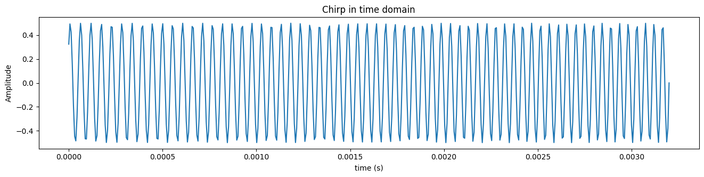
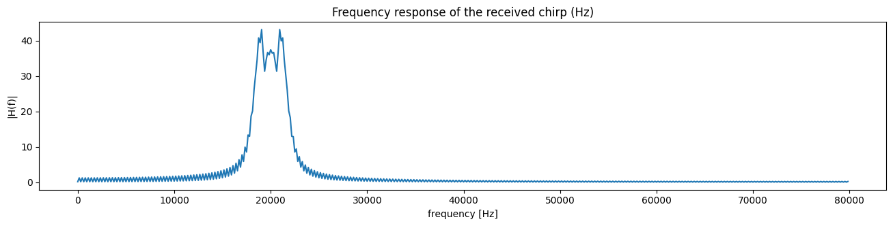
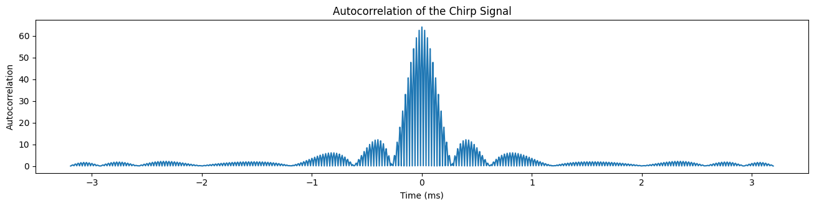
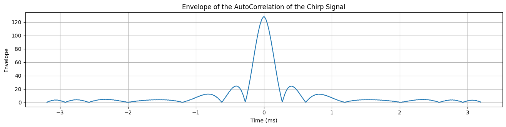
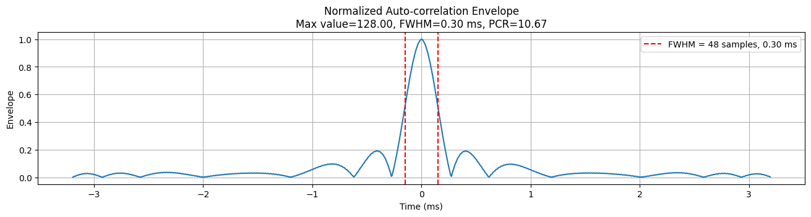

# Pulse Compression


#### 송신 신호의 세기를 키우면 안되나?

짧은 CW 펄스는 유지한 채, 센서 마이크가 보내는 신호의 세기를 크게 하면 되지 않을까? 사실 신호의 세기를 무작정 크게 할 수는 없다. 컴퓨터 스피커를 생각해보자. 컴퓨터 스피커의 볼륨을 올려 지속적으로 큰 소리를 낸다면, 전력 소모도 클 것이고 스피커의 내구성에 문제가 생길 수도 있다. 애초에 큰 소리를 내기 위해 컴퓨터 스피커의 하드웨어 스팩도 좋아야 한다.

센서도 마찬가지다. 신호 세기를 키우기 위해서는, 큰 전력 소모를 버틸 수 있는 고전압의 전원과 마이크가 필요하다. 큰 소리를 내기 위해 마이크는 비싸지고, 커져야 하고, 추가적인 내구성 테스트도 필요하다. 그래서 사실 무작정 신호 세기를 키워서 SNR을 확보하겠다는 방안은 현실적이지 않다.

### 선형 주파수 변조를 통한 펄스 압축

***

#### 기본 원리

그렇다면 SNR을 확보할 수 있도록 펄스를 충분히 길게 하면서도, 거리 해상도를 희생하지 않는 방법은 없을까? 여기서 바로 펄스 압축이 등장한다. 펄스 압축의 기본 원리는 다음 두 가지이다.

* 신호의 에너지가 충분히 보존되도록, 신호를 긴 시간동안 송신
* 매치 필터(matched filtering) 후에, 상관 신호의 길이가 일반적인 CW 사인파의 신호 길이보다 작도록 신호를 설계

자동차의 ADAS 센서, 특히 레이더와 초음파에서는 펄스 압축을 위해 주로 선형 챠프(linear chirp, 주파수가 시간에 따라 일정하게 변조되는 신호)가 사용된다. 먼저 송신 신호의 길이가 T라고 하자. t=0에서 시작하고 t=T에서 끝나는 이 신호의 주파수가 캐리어 주파수 $$f_c$$를 중심으로 $$\Delta f$$만큼 선형적으로 변화한다면, 신호 $$s_c(t)$$의 식은 다음과 같이 쓸 수 있다.

$$
s_c(t) = \left\{ \begin{array}{ll} e^{i 2 \pi \left( \left( f_c \,-\, \frac{\Delta f}{2}\right) t \, + \, \frac{\Delta f}{2T}t^2 \, \right)} &\mbox{if} \; 0 \leq t < T \\ 0 &\mbox{otherwise}\end{array}\right.
$$

<details>

<summary>식의 도출 과정</summary>

신호의 주파수는 캐리어 주파수 $$f_c$$를 중심으로 $$\Delta f$$만큼 선형적으로 변화한다. 즉, 주파수는 $$f_c - \Delta f/ 2$$ (t=0)부터 $$f_c + \Delta f/ 2$$(t=T)까지 변한다. 따라서 이를 시간에 대한 함수로 나타낸다면, t 시점의 순간 주파수를 정의할 수 있다.

$$f(t) = f_c - \Delta f/2  + (\Delta f/T)t$$

순간 주파수를 시간에 대해 적분한다면, 다음과 같이 위상도 구할 수 있다.

$$\phi(t) = 2\pi\int_0^t f(t')dt' = 2\pi\int_0^t (f_c - \Delta f/2  + (\Delta f/T)t')dt' = 2\pi(f_c - \Delta f/2  + (\Delta f/{2T})t)t$$

따라서 복소수 신호 표현 $$s_c(t) = e^{i\phi(t)}$$에, 위에서 구한 위상의 식을 넣으면 신호의 식을 구할 수 있다.

참고로, 복소수 표현은 신호의 위상과 진폭을 분리해 분석할 수 있다는 이점이 있다. 또한 이 표현은 오일러 공식 $$e^{i\phi(t)} = cos(\phi(t)) + isin(\phi(t))$$에 기반한다.

</details>

위 식이 선형 주파수 변조가 된 신호로, 보통 영어로는 챠프(chirp)라고 한다. 이 챠프 신호의 위상은

$$
\phi(t) = 2\pi \left( \left( f_c \,-\, \frac{\Delta f}{2}\right) t \, + \, \frac{\Delta f}{2T}t^2 \, \right)
$$

따라서 순간 주파수(instantaneous frequency)는 정의에 따라 다음과 같이 계산된다. '잠깐, 순간 주파수는 왜 위상을 시간에 대해 미분하는거지?'라는 의문이 든다면, 별도의 글 [instantaneous-phase-and-frequency.md](instantaneous-phase-and-frequency.md "mention")을 읽어보자.&#x20;

$$
f(t) = \frac{1}{2\pi}\left[\frac{d\phi}{dt}\right ]_t = f_c-\frac{\Delta f}{2}+\frac{\Delta f}{T}t
$$

주파수가 어떻게 변하는지 보려면, 신호의 처음과 마지막의 주파수를 확인하면 된다. 신호는 t=0에 시작해 t=T에 끝나므로, 주파수는 $$f(0) = f_c - \Delta f/ 2$$ 부터 $$f(T) = f_c + \Delta f/ 2$$까지 변화한다는 것을 알 수 있다.

예를 들어, $$f_c = 20kHz, \Delta f=4kHz$$, 즉 시작할 때 주파수가 f(0)=18kHz, 끝날 때 주파수가 f(T)=22kHz인 선형 챠프 신호를 파이썬으로 구현해보자. 샘플의 길이는 512로 설정한다고 가정한다.

```python
num_of_samples = 512
fs = 22000 * 8
t = np.linspace(0, num_of_samples/fs, num_of_samples)
f0 = 18000
f1 = 22000

# generate chirp signal
f_of_t = f0 + (f1 - f0) * t / (num_of_samples/fs)
phi_of_t = 2 * np.pi * np.cumsum(f_of_t) / fs

# generate the chirp function s_chirp with an amplitude of 0.5
s_chirp = 0.5 * np.sin(phi_of_t)
```

만든 이 신호를 시간 영역과, 주파수 영역에서 나타내보자.

<figure><figcaption></figcaption></figure>

<figure><figcaption></figcaption></figure>

송신 신호 $$s_c(t)$$를 어떻게 표현할지는 알았으니, 이제는 수신 신호 $$r(t)$$를 표현해 보자. 센서의 신호는 물체에 반사되면서, 온도 및 습도 등의 다양한 영향을 받아 그 진폭이 변해 센서의 마이크로 다시 돌아오게 된다. 그렇다면 수신 신호는 송신 신호가 반사된 시간만큼 느려지고, 진폭이 변한 신호로 표현할 수 있을 것이다. 그러나 이게 끝이 아니다. 노이즈가 추가된다. 이 노이즈는 $$[f_c -\Delta f/2,f_c +\Delta f/2 ]$$ 영역에서 일정한 에너지(정확히는 power spectral density)를 갖고,  다른 영역에서는 0의 에너지를 가진다. 이를 식으로 표현해 보자.

$$
r(t) = \left\{ 
\begin{array}{ll} 
Ae^{i 2 \pi \left( \left( f_c - \frac{\Delta f}{2} \right) (t - t_r) + \frac{\Delta f}{2T} (t - t_r)^2 \right)} + N(t) & \text{if } t_r \leq t < t_r + T \\ 
N(t) & \text{otherwise}
\end{array}
\right.
$$

#### 송신 신호와 수신 신호 사이의 상호상관cross-correlation

송신 신호와 수신 신호을 수학적으로 어떻게 표현할지 알았으니, 두 신호 사이의 상관관계를 구하면 된다. 그러기 위해서는 두가지 절차를 밟아야 한다.

첫째는 계산을 간결하게 만드는 것이다. 송신 신호와 시간 딜레이가 $$t_r$$만큼 있는 수신 신호의 상호상관(cross-correlation)을 구하는 대신에, 자기상관(auto-correlation)을 구하면 계산이 간단해진다. 즉, 딜레이 $$t_r$$로 인해 계산이 복잡해 지는 것을 막기 위해, 자기 자신과의 상호 상관=자기 상관을 구하는 것이다. 이는 해상도와 진폭을 바꾸지 않기 때문에 유용하다.

따라서 수신 신호 $$r(t)$$를 $$-t_r$$만큼 이동시켜 시간 딜레이를 무시하고, 송신 신호와 타이밍을 일치시킬 것이다.

$$
r'(t) = \begin{cases}
A e^{2 i \pi \left( f_c + \frac{\Delta f}{2T} t \right) t} + N(t) & \text{if } -\frac{T}{2} \leq t < \frac{T}{2} \\
N(t) & \text{otherwise}
\end{cases}
$$

둘째는 참조 신호(송신 신호)의 진폭을 1이 아닌, 다른 값 $$\rho$$를 설정하는 것이다. 상수 $$\rho$$는 상관을 통해 에너지가 보존될 수 있도록 정해야 한다.

$$
s_c'(t) = \begin{cases}
\rho e^{2 i \pi \left( f_c + \frac{\Delta f}{2T} t \right) t} & \text{if } -\frac{T}{2} \leq t < \frac{T}{2} \\
0 & \text{otherwise}
\end{cases}
$$

이 두 신호의 상관관계를 구하면 다음과 같다. 아래 식에서 $$N'(t)$$는 참조 신호와 수신 노이즈의 상관관계를 구한 값이다.

$$
\langle s_c', r' \rangle (t) = \rho A \sqrt{T} \Lambda \left( \frac{t}{T} \right) \mathrm{sinc} \left[ \Delta f t \Lambda \left( \frac{t}{T} \right) \right] e^{2 i \pi f_c t} + N'(t)
$$

이를 파이썬으로 구현해보자.

```python
## 1. Compute the autocorrelation of the chirp
# Flip the chirp signal
chirp_flipped = np.flip(s_chirp) # same as s_chirp[::-1]

# Compute the autocorrelation using convolution
# The 'full' mode returns the full discrete linear convolution of the two input signals,
# which will have a length of 2N-1
autocorr = signal.convolve(s_chirp, chirp_flipped, mode='full')

## 2. Recover the envelope of the autocorrelation
# analytic signal
s_chirp_a = np.exp(1j * phi_of_t)

# Perform cross correlation between s_chirp_a(analytic signal) and s_chirp
# signal.correlate is almost same as signal.convolve, but it does not flip the second signal
cross_corr = signal.correlate(s_chirp_a, s_chirp, mode='full')
time_ms = np.arange(-len(s_chirp)+1, len(s_chirp)) * 1000 / fs
```

<figure><figcaption><p>Autocorrelation of the chirp signal.</p></figcaption></figure>

<figure><figcaption><p>Envelope of Autocorrelation(=cross-correlation between chip and analytic signal). <br>the absolute value of the result represents the envelope.</p></figcaption></figure>

#### 상관 이후의 신호 넓이

노이즈가 0이라고 가정하면, $$s_{c'}$$의 자기상관 함수의 최대값은 x=0에 있다. x=0 주변에서, 이 함수는 $$sinc(x)=sin(\pi x)/(\pi x)$$ 함수의 형태를 따른다.&#x20;

<figure><figcaption><p>normalized sinc (blue) and unnormalized sinc function (red)</p></figcaption></figure>

이 함수의 메인 로브가 반절(-3dB)으로 줄어들기까지의 신호 폭은 대략 $$T'= 1/{\Delta f}$$와 같다. 이 신호의 거리 해상도는, 길이 $$T'$$의 CW 신호의 거리 해상도와 같은 효과를 지닌다. 그런데 일반적으로 이 $$T'$$가 원래 챠프의 신호 길이었던 $$T$$보다 작아지도록 주파수 대역 $$\Delta f$$를 설계한다. 그래서 펄스 압축이라는 이름이 붙는다.

> 결과 2: 대역 $$\Delta f$$의 선형 주파수 변조 신호의 거리 해상도는 $$c \over {2 \Delta f}$$이다.
>
> 여기서 c는 파형의 속도를 의미한다. 레이더라면 c는 광속, 초음파 센서라면 c는 음속이 될 것이다.

거리 해상도는$${c \over {2 \Delta f}} = {cT' \over 2 }$$로도 나타낼 수 있다. 여기서 CW신호의 거리 해상도가 $$cT \over 2$$였다는 것을 떠올려 보자. 결국 CW신호의 거리 해상도와, 선형 주파수 변조 신호(챠프 신호)의 거리 해상도 식은 달라 보여도 사실은 같은 것이었다. 즉, 긴 챠프 신호를 매치 필터에 통과시켜 얻은 상관신호의 너비 $$T'$$가 CW신호의 너비 $$T$$보다 짧도록 설계하는 것이 펄스 압축의 핵심이다.

한편 펄스 압축이 얼마나 잘 이루어졌는지를 평가하는 지표도 있다.

> 펄스 압축률(Pulse Compression Ratio)이란?
>
> 신호 길이 T를 펄스의 매칭 필터의 -3dB 너비 T'로 나눈 값을 펄스 압축률이라고 정의한다.
>
> 즉, $$T / T' = T \Delta f = PCR$$으로, PCR은 일반적으로 1보다 큰 값이 된다.

파이썬으로 확인해보자.

```python
def fwhm(signal, return_start_end=False):
    """
    Calculate the Full Width at Half Maximum (FWHM) of a signal.
    
    Parameters:
    signal (array-like): The input signal.
    
    Returns:
    fwhm (float): The full width at half maximum of the signal given in index.
                  If the condition is not met, returns 0.
    """ 
    # find the maximum value of the signal
    max_val = np.max(signal)
    # find the half maximum value
    half_max = max_val / 2
    # find the indices of the values greater than the half maximum value
    indices = np.where(signal > half_max)[0]
    # find the full width at half maximum
    if len(indices) > 1:
        fwhm_in_idx = indices[-1] - indices[0]
        if return_start_end:
            return fwhm_in_idx, (indices[0], indices[-1])
        else:
            return fwhm_in_idx
    else:
        raise ValueError("The condition is not met. The signal does not have a FWHM.")
    
# calculate the FWHM of the envelope
corr_env = abs(cross_corr)
fwhm_in_idx, fwhm_start_end_idx = fwhm(corr_env, return_start_end=True)
fwhm_in_time = fwhm_in_idx * 1000 / fs
# print the FWHM in two decimal places
print(f"FWHM of the envelope: {fwhm_in_time:.2f} ms")

# cacluate the pulse compression ratio
# pulse compression ratio = length of pulse / FWHM of the main lobe of the matched-filter
pulse_compression_ratio = len(s_chirp) / fwhm_in_idx

# Normalize the envelope to make its maximum value 1
corr_env_normalized = corr_env / np.max(corr_env)
max_val = np.max(corr_env)
```

<figure><figcaption><p>Normalized cross-correlation envelope.PCR is 10.67</p></figcaption></figure>

자기상관 함수의  $$sinc(x)$$함수는 사이드로브가 존재하는데, 이를 없에기 위해서는 Hanning, Hann 등의 윈도우를 사용할 수 있다. 윈도우 함수를 적용하면 진폭의 최대치가 조금 낮아지지만 사이드로브는 없는 신호를 얻을 수 있다.


