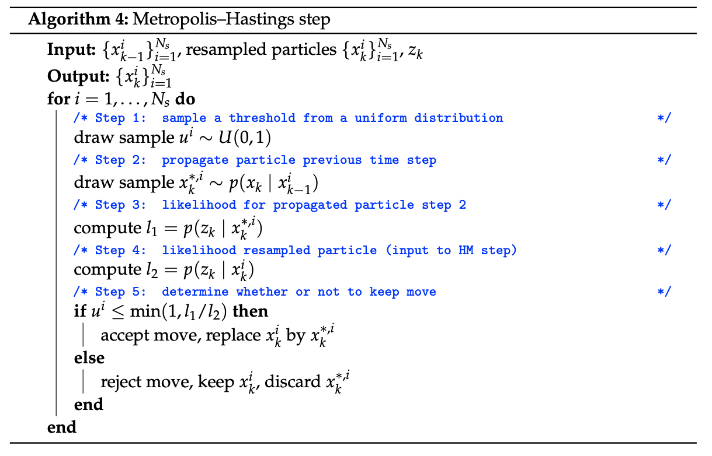

# Particle Filter

### 파티클 필터가 겪는 문제들

#### 1. 퇴화 현상 (Degeneracy Problem)

&#x20; 알고리즘 1을 사용할 경우, 몇 번의 반복 이후에는 한 파티클의 가중치가 거의 1에 가까워지고 다른 모든 파티클의 가중치는 거의 0이 된다. 이 현상을 퇴화 현상이라고 한다. 퇴화 현상으로 인해 발생하는 문제점은 두 가지이다. 하나는 거의 모든 계산 노력이 추정에 거의 기여하지 않는 파티클을 계산하는 데에 사용된다는 것이다. 다른 하나는 효과적인 파티클이 오직 하나밖에 없다는 것이다.&#x20;

&#x20; 특히 후자는 필터의 성능과 표현력을 크게 제한한다. 먼저 성능 하락은 파티클 필터가 발산하기 때문에 일어난다. 발산은 상태 추정 오류가 시간이 지남에 따라 용납할 수 없을 정도로 크게 증가했을 때 발생한다. 발산하는 단계에 들어서면, 필터는 진짜 상태를 따라가거나 추정 오류를 용납할 수 있을 정도로 줄이는 데 실패한다. 다음으로 표현력 제한은 하나의 파티클이 임의의 형태의 확률 밀도 함수가 아닌, 상태 공간에서의 한 점만을 표현할 수 있기 때문에 발생한다.

&#x20; 이 문제를 해결하기 위한 방법은 리샘플링이다. 업데이트 단계 직후에 수행되는 리샘플링에서, 새로운 파티클은 가중치를 지닌 파티클 집합에서 무작위로 선택된다. 파티클을 선택할 확률은 그 파티클의 가중치에 비례한다. 전체 파티클의 수는 변하지 않는다. 높은 가중치를 지닌 파티클은 중복된 가능성이 높고, 낮은 가중치를 지닌 파티클은 제거될 가능성이 높다. 리샘플링 후에는 일반적으로 가중치가 $$1/N_S$$로 설정된다.

#### 2. 샘플 빈곤화 (Sample Impoverishment)

&#x20; 리샘플링을 통해 퇴화 현상을 해결하면 동일한 가중치를 가진 여러 인스턴스가 생성된다. 중요도 밀도(importance density)로 가장 일반적인 $$p(x^i_k | x^i_{k-1})$$ 을 고른다고 가정하면, 예측 단계는 결정론적 부분과 확률론적 부분을 포함한다. 결과적으로, 동일한 상태의 파티클은 예측 단계 동안 다양화 될 것이다. 만약 프로세스 모델의 노이즈 분산이 매우 낮다면, 샘플은 거의 다양화되지 않는다. 이 경우, 몇 번의 반복 끝에 모든 파티클이 상태 공간에서 단일 지점으로 수렴하게 된다. 그러면 모든 $$N_s$$ 파티클이 동일한 상태를 나타내게 된다. 필터가 사실상 하나의 파티클로만 이루어지게 되는 것이다. 이를 바로 샘플 빈곤화라고 한다. 퇴화 현상과 마찬가지로, 필터는 성능과 표현력을 잃고, 발산하게 된다.

&#x20; 일반적으로 프로세스 모델의 노이즈를 충분한 양으로 설정하면 샘플 빈곤화를 막을 수 있다. 뒤에서 해결책에 대해 더욱 자세히 설명할 것이다.

#### 3. 발산 (Divergence)

&#x20; 실제 문제에 파티클 필터를 사용할 때, 발산 위험을 항상 고려해야 한다. 왜 필터가 발산하는 걸까? 이유는 필터의 부적절한 설정이나 잘못된 모델링 가정, 일관성 없는 측정 데이터 또는 하드웨어 실패에 이르기까지 다양할 수 있다. 관측 노이즈 가정이 정확하지 않거나, 프로세스 모델이 정확하지 않게 가정된 경우도 포함된다. 따라서 이러한 발산이 발생하지 않도록, 파티클 필터를 모니터링 해 줘야 한다.

#### 4. 중요도 밀도 선택 (Selecting the Importance Density)

&#x20; 중요도 밀도는 파티클 필터 알고리즘의 핵심이다, 적절한 함수를 선택하는 것은 필터 설계 시 가장 중요한 단계 중 하나이다. 예를 들어, 추정해야 할 사후 분포는 평균이 0인 가우시안 분포인데, 중요도 밀도는 균등 분포를 설정했다고 가정하자. 이 때 중요도 밀도의 선택은 유효(valid)하지만 그다지 정보적(informative)이지는 않다. 즉, 최소한의 요건은 충족하지만 최적의 해결책은 아니라는 것이다.

&#x20; 알기 쉽게 설명해보겠다. 먼저 균등 분포의 선택이 유효한 이유를 살펴보자. 균등 분포는 모든 가능한 상태에 대해 동일한 확률을 부여하여, 파티클이 상태 공간 전체에 분포될 수 있게 한다. 덕분에 광범위한 상태 공간을 탐색하며 가능한 상태를 선택할 수 있다. 따라서 유효하다.

&#x20; 그러나 이 선택은 그다지 정보적이지는 않다. 균등 분포는 문제의 특성이나 사전 지식을 반영하지 않는다. 추정해야 할 사후 분포가 평균이 0인 가우시안 분포라는 것을 떠올려 보자. 이 분포는 특정 위치에 대한 확률이 더 높다. 그러나 균등 분포는 모든 가능성을 동일하게 취급한다. 이로 인해 많은 파티클이 사후 분포의 중요하지 않은 영역에 할당될 수 있고, 이는 상태 추정의 정확도와 효율성을 떨어뜨린다. 결과적으로 부적절한 중요도 밀도를 통해 가우시안 분포의 형태를 잘 포착하기 위해서는, 상대적으로 많은 수의 파티클이 필요하다.

#### 5. 실시간 실행 (Real Time Execution)

&#x20; 파티클 필터는 추정하는 분포를 표현하기에 충분한 수의 파티클이 있을 때만 작동한다. 파티클의 수는 필터의 계산 비용에 직접적인 영향을 미친다.

### 파티클 필터가 겪는 문제들의 해결 방법

#### 1. 퇴화 현상 (Degeneracy Problem)의 해결

리샘플링을 언제, 어떻게 해야할지 도움이 되는 간단한 방법을 소개한다.

#### 1-1. '언제' 리샘플링을 할까?

&#x20; 먼저 리샘플링 시기를 어떻게 정해야 할까. 가장 간단한 방법은 '매 타임스텝 마다 하는 것'이다. 이는 퇴화 현상을 방지하는 가장 인기있는 방법 중 하나이다. 하지만 리샘플링은 연산 비용이 높기 때문에 부담이 된다. 또한 매번 리샘플링을 하면 파티클 집합의 다양성을 줄이기 때문에, 샘플 빈곤화의 위험을 높일 수도 있다. 따라서 매번 리샘플링을 실행하기 보다는, 조금 적은 빈도로 실행하더라도 퇴화 현상을 막을 수 있는 방법을 찾는 것이 좋다.

<figure><figcaption>
매번 리샘플링을 하는 알고리즘
</figcaption></figure>

&#x20; 파티클의 퇴화를 평가할 수 있는 좋은 지표가 있다면 리샘플링의 빈도를 줄이면서 효과적으로 퇴화 현상을 방지할 수 있을 것이다. 가장 많이 쓰이는 방법은 '효과적인 샘플 사이즈' $$\hat{N}_{\text{eff}}$$을 사용해 리샘플링할 시기를 정하는 것이다. 효과적인 샘플 사이즈란, 확률 분포에 유의미하게 기여하는 파티클의 개수를 뜻한다. 다음과 같은 식으로 구할 수 있다.

$$
\hat{N}_{\text{eff}} = \frac{1}{\sum_{i=1}^{N_s} (w_k^i)^2}
$$

여기서 $$w_i$$는 $$i$$번째 파티클의 가중치이다. 효과적인 파티클 수가 전체 파티클 수 $$N_s$$에 비해 상당히 낮다면, 이는 소수의 파티클만이 전체 추정치에 대부분 기여하고 있다는 신호이다. 따라서 . 따라서, $$\hat{N}_{\text{eff}}$$이 $$N_s$$에 비해 작은 값을 가질 때, 리샘플링을 수행한다.&#x20;

만약 $$\hat{N}_{\text{eff}}$$가 특정 임계값, 예를 들어 $$N_s/2$$ 보다 작다면, 파티클 가중치의 분산이 충분하지 않다고 판단하고 리샘플링을 통해 파티클을 다시 균일하게 분포시키게 된다. 이 과정은 전체 가중치에 기여하는 파티클의 다양성을 높여, 필터의 성능을 유지하고 발산을 방지하는데 도움이 된다. 밑의 이미지는 $$\hat{N}_{\text{eff}}$$에 기반해 리샘플링의 시기를 정하는 알고리즘의 의사 코드이다.

<figure><figcaption>
\hat{N}_{\text{eff}}에 기반해 리샘플링의 시기를 정하는 알고리즘
</figcaption></figure>

대부분의 파티클 필터는 위에서 제시한 두 가지 리샘플링 시점 기준 중 하나를 사용한다. 특히 상태의 차원이 낮다면 더욱 그렇다. 그러나 다른 방법으로도 효과적인 샘플 수를 측정할 수 있다. 한 가지 방법은 효과적인 샘플 사이즈를$$1 / \max_i(w_k^i)$$으로 계산하고, 이 값이 특정 임계값 밑으로 떨어지면 리샘플링을 하는 것이다.&#x20;

위 방법이 효과가 없다면, 덜 일반적인 재샘플링 기준을 선택할 수 있다. 예를 들면, 사전에 정의된 값보다 낮은 가중치를 가진 파티클만을 리샘플링 대상으로 삼는 것이다. 더 나아가 해결하고자 하는 문제의 기존 지식이 있다면, 특정 영역의 상태 공간에서 파티클을 재생성할 수 있다.&#x20;

또 다른 접근 방법은 결정론적 재샘플링(deterministic resampling)이다. 리샘플링을 할 때, 파티클의 가중치뿐만 아니라 상태도 고려되어, 낮은 가중치를 가진 파티클을 무차별적으로 버리는 것을 피하는 방법이다.&#x20;

#### 1-2. '어떻게' 리샘플링을 할까?

리샘플링은 $$N_s$$개의 가중치가 더해진 파티클을 새로운 $$N_s$$개의 (주로 균등한) 가중치가 더해진 파티클로 바꾸는 확률적인 단계이다. 물론 파티클의 수를 실시간으로 변경하는 방법론도 있으나, 여기에서는 일단 파티클의 수가 일정하다고 가정하자.

리샘플링 알고리즘은 다양하다. 그러나 대부분의 파티클 필터는 다항 리샘플링(multinomial resampling), 잔여 리샘플링(resuidual resampling), 체계적 리샘플링(systematic resampling), 계층화 리샘플링(stratified resampling) 중 하나의 알고리즘을 사용한다.

일반적으로, 최고의 리샘플링 알고리즘은 존재하지 않는다. 체계적 리샘플링이 다항 리샘플링보다 성능이 나쁘다는 논문도 있는 반면, 체계적 리샘플링이 그 결과의 질과 계산 복잡도 측면에서 가장 좋은 알고리즘이라고 주장하는 논문도 있다.&#x20;

어느 알고리즘을 사용해야 할지 결정해야 할 때는 '예측 가능성'의 차이를 인식하면 좋다. 먼저 동일한 파티클에 대해 한 가지 재샘플링 알고리즘을 여러 번 적용했을 때, 결과의 일관성을 기대할 수 있어야 한다. 그렇지 못하면 매 실행마다 매우 다른 결과가 나올 수 있다. 또한 일부 재샘플링 방법은 선택 과정에서 편향을 초래할 수 있기 때문에 주의해야 한다. 예를 들어, 특정 파티클이 과다하게 선택된다면, 전체 파티클 집합의 추정 확률 분포를 왜곡할 수 있다. 따라서 알고리즘의 예측 가능성의 차이를 인식하고, 이를 요구사항에 맞추어 적절하게 선택하는 것이 중요하다.

#### 2. 샘플 빈곤화 (Sample Impoverishment)의 해결

샘플 빈곤화를 다루는 여러가지 방법을 설명한다.

#### 2-1. 조잡화 (Roughening)

샘플 빈곤화를 피하기 위해서는 어떻게 해야 할까? 쉽게 떠오르는 방법은 프로세스 모델의 노이즈를 인위적으로 증가시키는 것이다. 학계에서는 다음의 두 가지 방법론을 제시한다.

* 재샘플링 후 인공적인 노이즈를 추가
* 전파 단계에서 사용된 프로세스 모델에 흐트러짐(jitter)를 추가

이 조잡화를 언제 적용힐지, 얼마나 많은 노이즈를 추가해야 하는지, 어떤 차원에 적용해야 하는지는 일반적으로 딱 집어 말하기는 어렵다. 그러나 다음 사항을 염두해 두자.

* 조잡화는 샘플 빈곤화에 효과적인 조치가 될 수 있다.
* 파티클의 수가 상대적으로 적을 경우, 조잡화가 더 유용하다.
* 조잡화 방법의 복잡성은 필요에 따라 튜닝될 수 있으며, 파티클 필터 튜닝 과정의 일부이다.

#### 2-2. 보조 파티클 필터 (Auxiliary Particle Filters)

표준 파티클 필터에서, 첫 번째 단계인 예측은 임의로 샘플을 추출한다. 두 번째 단계인 보정은 관측치와 첫 번째 단계에서 예측된 파티클의 상태를 사용해 가중치를 업데이트한다. 보조 파티클 필터의 역할은 예측 단계에서, 관측치를 보정 단계에 통합한 후에 높은 가능도를 얻을 것 같은 파티클을 선호하는 것이다. 이를 위해서는, 최신 관측치를 예측 단계에서 활용해야 한다. 사전 분포에서 무작정 샘플을 뽑는 것이 아니다. 보조 파티클 필터의 알고리즘을 요약하면 다음과 같다.

1. $$p(x_k | x_{k-1}^i):{\mu}_k^i \sim p(x_k | x_{k-1}^i)$$를 사용하여 $$N_s$$개의 점 추정치를 계산한다. 이를 특성화(characterization)라고 한다. 이전 상태 $$x_{k-1}^i$$가 주어졌을 때, 현재 상태 $$x_k$$의 조건부 확률을 구하고, 그 확률에서 추출한 샘플 $$\mu_k^i$$로 점 추정치를 계산한다. 또한 여기서  $${\mu}_k^i \sim p(x_k | x_{k-1}^i)$$는 점 추정치 $$\mu_k^i$$가 $$p(x_k | x_{k-1}^i)$$의 확률 분포를 따른다는 의미이다. 점 추정치를 계산했으면 그 다음으로 $$w_k^i \propto p(z_k | \mu_k^i) w_{k-1}^i$$에 대한 가중치를 계산하고, 가중치를 정규화한다.
2. 1단계에서 계산된 $$x_{k}^i$$가중치를 재샘플링 단계에서 사용한다. 재샘플링하는 동안, 실제 재샘플링을 수행하는 대신, 선택되었을 파티클의 인덱스 $$i^j$$(i는 파티클의 고유 번호, j는 재샘플 과정에서 해당 파티클이 선택된 순서나 횟수?)를 저장한다. 즉, 파티클이 복제되거나 삭제되지 않는다. 각 인덱스 $$i^j$$는 k-1 시점에서의 파티클을 나타내며, 인덱스 집합은 높은 가능성을 얻을 것으로 예상되는 파티클 집합을 나타낸다. 이 재샘플링 단계에서 $$N_s$$개의 인덱스 $$i^j$$가 저장된다. 일부 파티클의 인덱스는 여러 번 나타나는 반면 다른 일부는 전혀 선택되지 않는다.
3. 2단계에서 얻은 $$N_s$$개의 파티클 인덱스 $$i^j$$ 각각에 대해 예측 단계를 수행한다.&#x20;
4. 3단계에서 전파된 파티클의 가중치를 다음과 같이 계산한다. 여기서 분모는 1단계에서 계산된 특성화 $${\mu}_k^i \sim p(x_k | x_{k-1}^i)$$의 가능도(likelihood)이고, 분자는 3단계에서 전파된 파티클의 가능도이다. 가능도$$p(z_k | x_k^j)$$은 1단계와 2단계로 인해 높을 것으로 예상된다. 그 후 정규화를 수행한다.

$$
w_k^j = \frac{p(z_k | x_k^j)}{p(z_k | \mu_k^{i^j})}
$$

위 알고리즘에서, 특성화 $${\mu}_k^i \sim p(x_k | x_{k-1}^i)$$는 측정치가 주어졌을 때 높은 가능도를 얻을 수 있는지 예측하기 위해 사용된다. 물론 한 가지 파티클의 상태를 표현하기 위해, 이와 다른 특성화 방법을 사용할 수 있다. 그러나 특성화가 다르면 측정치를 통합한 후의 가능도도 달라진다. 결과적으로 파티클 필터의 성능이 원래 파티클 필터보다 떨어질 수 있다. 보통 이런 일은 프로세스 모델의 노이즈가 많을 때 일어난다. 이런 경우에는 단일 점은 $$p(x_k | x_{k-1}^i)$$의 밀도를 특성화하기 충분하지 않고, 보조 파티클 필터는 표준 파티클 필터보다 성능이 떨어질 수 있다.&#x20;

또한 보조 파티클의 필터는 계산이 복잡하다. 일반적으로 보조 파티클 필터는 표준 파티클 필터보다 우수한 성능을 발휘한다. 그러나 계산해야 할 가능성의 수는 서로 다르다. 표준 파티클 필터의 경우 $$N_s$$개이며, 보조 파티클 필터의 경우 $$2N_s$$개이다. 많은 파티클을 실시간으로 처리해야 하거나 가능도 계산이 시간이 많이 걸린다면, 복잡도를 높일 수 있다.

#### 2-3. 재샘플링-이동 단계 (Resample Move Step)

샘플 빈곤화를 방지하는 좀 더 세련된 방법은 재샘플링-이동 단계(Resample Move Step)를 구현하는 것이다. 리샘플링을 수행한 이후, 각 파티클은 상태 공간 안에서 약간 이동될 수 있다. 이동에는 주로 메트로폴리스-해스팅스 알고리즘(Metropolis-Hastings algorithm)과 같은 마르코프 체인 몬테카를로(MCMC) 방법이 사용된다. 이는 파티클에 작은 확률적인 변화를 주어, 상태 공간의 다른 공간들 중에서 측정 및 모델과 일치하지만 현재 파티클이 없는 공간을 검색하게 한다. 아래는 메트로폴리스-해스팅스 알고리즘을 사용한 이동 단계를 의사 코드로 구현한 것이다.

<figure><figcaption>
메트로폴리스-해스팅스 알고리즘을 사용한 이동 단계
</figcaption></figure>

#### 3. 발산의 해결

상태 추정이 반복적으로 수행될 때마다, 추정치는 발산할 수 있다. 파티클 필터가 발산했다는 것은 파티클이 더 이상 진짜 상태를 반영하지 않는다는 것을 의미한다. 발산을 처리하기 위한 알고리즘이 없다면, 추정치를 얻어도 신뢰할 수 있다고 보기 힘들다.&#x20;

먼저 파티클 필터가 발산하는 주요 원인들을 생각해보자.

* 실제 노이즈보다 훨씬 더 낮게 모델링된 측정 노이즈. 현실적인 측정치는 큰 측정 노이즈 값을 부여받고, 가능도가 낮아진다. 측정 모델은 그런 노이즈가 발생할 확률이 낮다고 판단하고, 관련 파티클을 재샘플링 단계에서 제거해 버린다.
* 클러터나 이상치(outlier) 등, 잘못된 관측치의 사용은 추정 시에 잘못된 정보를 입력한다.
* 프로세스 모델이 가능한 모든 상태 전이의 일부분만에 국한될 때 발산할 수 있다. 실제 움직임과 프로세스 모델이 다르다면, 실제 상태와 다른 상태 공간으로 파티클이 전파될 것이다.

발산에서 회복하는 가장 쉬운 방법은 파티클 필터를 재초기화 하는 것이다. 물론 재초기화를 위해서는, 파티클 필터의 발산을 알 수 있어야 한다. 발산을 모니터링 할 수 있는 방법 중 하나는 '효과적인 샘플 사이즈' $$\hat{N}_{\text{eff}}$$을 사용하는 것이다.  이 방법은 간단하고, 파티클 필터가 발산하는 것으로부터 회복하기에 충분히 효과적이다.

다른 한 가지 방법은 쿨백-라이블러 발산(Kullback–Leibler divergence), 즉 상대 엔트로피를 사용하여 측정치와 추정치의 유사성을 모니터링하는 것이다. 쿨백-라이블러 발산은 한 확률 분포가 다른 분포와 얼마나 다른지를 측정하는 방법이다. KL 발산값이 크다면, 파티클 필터의 예측 분포와 실제 데이터 분포 사이에 상당한 차이가 있음을 의미하며, 이는 파티클 필터가 발산하는 것을 의미한다. 따라서 KL 발산이 미리 정의한 임계값보다 크다면, 파티클 필터를 재초기화할 수 있다.

#### 4. 중요도 밀도 선택 (Selecting the Importance Density)의 해결

이 글의 앞부분에서는 적절한 중요도 밀도가 파티클 필터의 성능을 결정짓는다는 것을 설명했다. 특히 사전 확률$$p(x_k | x_{k-1}^i)$$은 학계에서 일반적으로 적절한 선택이라고 입증되어, 가장 인기가 높은 중요도 밀도이다. 예측된 파티클 상태가 가능도보다 다음 상태에 대해 더 많은 정보를 포함하고 있을 때, 사전 확률을 중요도 밀도로 사용하는 것은 자연스럽다.  여기에서는 사전 확률 외에도, 중요도 밀도를 대체할 수 있는 두 가지 방법을 설명하고자 한다.

**4-1. 확장 칼만 파티클 필터 (Extended Kalman Filter)**

칼만 필터는 사후 확률이 정규 분포이고, 모델이 선형이며, 그 모델의 노이즈가 알려진 매개변수를 가진 정규 분포를 따를 때, 최적의 해를 제공하는 베이지안 필터이다. 이 선형/가우시안 케이스에서, 칼만 필터는 최적의 해결책을 제공한다.&#x20;

모델이 비선형이라면, 어떤 해결책이 있을까? 첫 번째 방법은 추정된 상태 주변에서 1차 테일러 전개를 이용해 비선형 모델을 지역적으로 선형 함수로 근사화하는 것이다. 비선형 함수의 추정치 근처에서 함수의 기울기를 계산하여 사용한다. 이 방법을 확장 칼만 필터(EKF)라고 한다. 다만, 비선형 모델을 선형화 과정을 통해 단순화하는 과정에서 추정 오류가 발생할 수 있다는 것은 단점이다.

이러한 EKF를 파티클 필터와 결합시켜 중요도 밀도를 개선할 수 있다. 확장 칼만 파티클 필터에서 각 파티클은 상태의 가능한 값 대신 EKF를 대표한다. 이 EKF의 가우시안 사후 분포가 중요도 밀도로 채택되며, 샘플은 가우시안 분포(정규 분포)에서 추출된다. 이러한 방법이 합리적인 이유는 가장 최근의 관측값을 상태의 최적 가우시안 근사치와 결합하여, 최적의 중요도 밀도를 근사하기 때문이다. 다만 EKF를 파티클에 통합하는 것은 계산 비용을 증가시키고 모델에 제약이 생긴다는 점은 주의해야 한다.

확장 칼만 파티클 필터와 표준 파티클 필터 사이의 주요 차이점은 다음과 같다.

* 각 파티클은 상태의 가능한 값만을 가지는 것이 아닌, 정규 분포(평균 벡터와 공분산 행렬)과 관련이 있다.
* 각 파티클에 대해 EKF의 예측 및 보정 단계가 이루어진다. 결과는 가장 최근의 관측치가 통합된 보정된 정규 분포이다. 따라서 사전 확률은 가능도 쪽으로 이동하게 된다.
* 새로운 파티클 상태 벡터는 EKF의 사후 분포에서 샘플링된다.

파티클 필터를 확장 칼만 필터로 바꾸는 것이 성능을 향상시킬까? 이를 알아보는 유일한 방법은 실험뿐이다. 추정의 정확도가 개선되는 것은 보장할 수 없다. 실제로 추정의 정확도는 사후 확률 분포에 대한 가우시안 가정(일반적으로 사후 확률 분포는 가우시안이 아니지만)의 정확성과, 비선형 모델을 선형화하는 과정에서 도입되는 부정확성에 의존한다.&#x20;

**4-2. 무항 파티클 필터 (Unscented Particle Filter)**

무향 칼만 필터(UKF)는 비선형 모델을 가진 추정 문제에 칼만 필터를 사용할 수 있게 해주는 두번째 방법이다. EKF와 비교했을 때, UKF는 더 정확한 추정치를 제공할 수 있다. 이는 비선형 모델의 일차 테일러 근사 대신 무향 변환을 사용하기 때문이다.&#x20;

무향 변환은 시스템의 상태 공간에서 몇 개의 대표적인 점(시그마 포인트)를 선택하고, 이 점을 비선형 모델을 통해 전파한 후, 결과를 바탕으로 가우시안 분포를 재구성한다. 무향 파티클 필터는 확장 칼만 파티클 필터에서 EKF를 UKF로 교체하여 구현할 수 있으며, 확장 칼만 파티클 필터보다 우수한 성능을 보인다. 물론 확장 칼만 파티클 필터와 마찬가지로, 무향 파티클 필터가 표준 파티클 필터보다 우월하다는 보장은 없다.

#### 5. 실시간 실행 (Real Time Execution)의 해결

실시간으로 파티클 필터를 적용할 때 고려해야 할 두 가지 문제가 있었다. 하나는 파티클 필터의 연산 비용이고, 다른 하나는 파티클 필터가 관측치를 받는 순서이다.

먼저 상태를 근사하기 위해 필요한 파티클의 수는 상태 공간의 차원에 따라 달라진다. 실제로, 차원이 $$n$$인 상태의 상태 공간을 채우려면 파티클의 수가 $$n$$과 함께 지수적으로 증가해야 한다. 이러한 '차원의 저주'를 다루는 방법을 여기서 설명할 것이다.

또한, 파티클 필터의 실시간 실행은 '순서가 다른 관측치'(out-of-sequence measurements, OOSM)에 의해 복잡해 질 수 있다. OOSM은 관측 순서가 파티클 필터가 관측값을 처리하는 순서와 다른 관측치를 뜻한다. 이는 전송 시간이나 센서 데이터 취득 및 처리 시간이 다른 여러가지 센서가 있는 환경에서 발생한다. OOSM을 다루는 방법도 여기서 설명할 것이다.

**5-1. Rao–Blackwellized 파티클 필터**

차원의 저주를 다루는 방법 중 하나는 Rao–Blackwellized Particle Filter를 도입하는 것이다. 상태 시퀀스 $$x_{1:k}$$를 두 개의 더 작은 부분인 $$x^1_{1:k}$$과 $$x^2_{1:k}$$로 분할한다고 생각해 보자. 이제 사후 확률 $$p(x_{1:k} | z_{1:k})= p(x^1_{1:k}, x^2_{1:k} | z_{1:k})$$은 다음과 같이 인수분해 될 수 있다.

$$
p(x^1_{1:k}, x^2_{1:k} | z_{1:k}) = p(x^1_{1:k} | z_{1:k}) \cdot p(x^2_{1:k} | x^1_{1:k}, z_{1:k})
$$

라오-블랙웰화에서는 많은 추정 문제에서 나타나는 조건부 독립 구조를 활용하여 필터의 연산 비용을 낮춘다. 즉, 위 식의 오른쪽 첫 번째 항이 알려지면, 두 번째 항을 계산하기가 더 쉬워진다. 예를 들어, 두 번째 항이 선형 모델과 정규분포를 조건으로 가진다면, 적분을 근사값이 아닌 수학적 공식을 사용해 정확하게 계산할 수 있다. 그 경우, 칼만 필터로 $$p(x^1_{1:k} | z_{1:k})$$를 추정하고, 칼만 필터로 $$p(x^2_{1:k} | x^1_{1:k}, z_{1:k})$$로 추정한다. 따라서 라오-블랙웰화된 파티클 필터에서, 각 파티클은 $$x^1$$에 대한 값을 추정하고, 칼만 필터는 파티클 값을 $$x^1$$로 가정하고 $$x^2$$를 추정힌다.&#x20;

라오-블랙웰화 파티클 필터는 중요도 밀도 해결에서 설명된 칼만 파티클 필터와 다르다. 칼만 파티클 필터에서는 각 파티클이 전체 상태 $$x$$를 추정하는 칼만 필터로 표현되며, 분할이 발생하지 않는다.

**5.5.2. 적응형 파티클 필터 (Adaptive Particle Filter)**

차원의 저주를 다루는 다른 방법은 실시간으로 파티클의 수를 변화시키는 것이다. 파티클의 수를 변화시키는 것이 확장성을 향상시키지는 않지만, 파티클의 수를 가능한 한 낮게 유지할 수 있다. 파티클이 상태 공간의 작은 부분에 집중되어 있는 경우 적은 수의 파티클을 사용하고, 파티클 필터의 불확실성이 증가하는 경우 파티클의 수를 증가시키는 방법이 있다. 파티클의 수는 미리 정의된 확률로 실제 사후 확률과 샘플 기반 근사치 사이의 오차가 모든 시점에서 ε보다 작게 유지되도록 업데이트된다.

1. k-1 시점의 파티클 가중치에 비례하여 파티클 인덱스를 샘플링한다.
2. 프로세스 모델을 사용하여 1단계에서 샘플링한 파티클을 전파한다.
3. 필요한 파티클 수를 갱신한다. 이는 상태 공간을 구간으로 나누고, 적어도 하나의 파티클을 포함하는 구간의 수를 세는 것으로 이루어진다. 구간에 더 많은 파티클이 포함되어 있다는 것은 파티클이 상태 공간의 더 넓은 부분을 커버한다는 것을 의미한다. 따라서 2단계에서 전파된 파티클이 빈 셀에 들어갈 경우, 필요한 파티클 수를 증가시킨다. 재샘플링하는 동안, 첫 번째 파티클은 대부분 빈 구간에 들어갈 가능성이 높으므로, 처음에는 파티클이 추가될 때마다 필요한 파티클 수가 증가한다. 나중에는 전파된 파티클이 대부분 이미 파티클이 있는 구간에 들어가게 되며, 필요한 파티클 수의 업데이트는 덜 필요해진다.
4. 파티클 수가 필요한 파티클 수 혹은 최대 파티클 수와 같아지면, 새로운 파티클 샘플링을 중단한다.&#x20;

1. 예를 들어, 다항 재샘플링을 사용하여 파티클 가중치에 비례하여 파티클 인덱스를 샘플링한다.
2. 파티클이 재샘플링되지 않은 구간에서 온 경우, 재샘플링된 구간 수를 업데이트하고, 해당 구간을 재샘플링되었다고&#x20;
